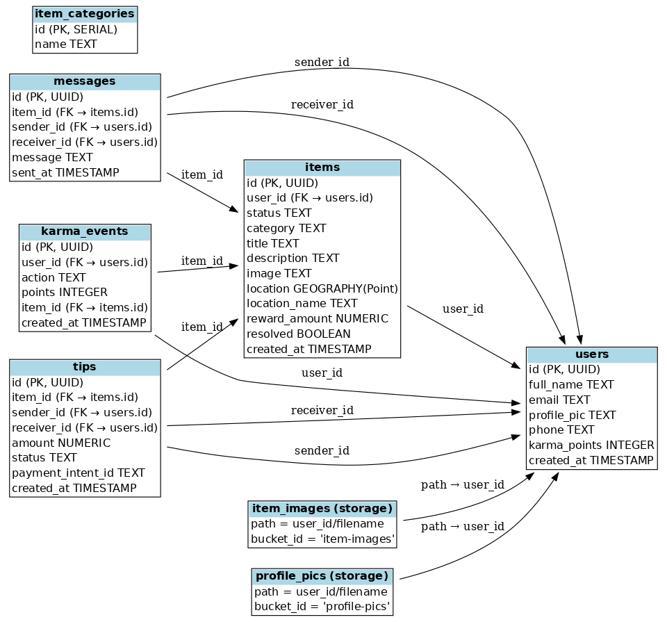

# 🦘 Findaroo – The Lost & Found Return Network

Findaroo is a mobile-first community app that helps people **find**, **report**, or **return** lost items across public spaces, campuses, transport, venues, and more — powered by locals, not just luck.

---

## 📌 Why Findaroo?

- 1 in 5 Australians lose personal items or parcels annually (over $224M lost)
- No centralized platform for transit, malls, Ubers, beaches, or libraries
- Facebook & Gumtree are fragmented and outdated
- Findaroo builds trust, connection, and community-powered recovery

---

## 🚀 MVP Features (Phase 1)

| Feature | Status |
|--------|--------|
| 📍 Lost/Found Item Posting (map + feed) | ✅ Planned |
| 🗺️ Geotag with Mapbox | ✅ Planned |
| 💬 In-app Chat between Finder and Loser | ✅ Planned |
| 🙋 User Profile + Karma | ✅ Planned |
| 📷 Image Upload (item & profile pics) | ✅ Planned |
| 🔐 Secure Auth (Supabase) | ✅ Planned |
| 🛠️ Supabase + RLS Policies | ✅ Done |
| 📁 Supabase Storage with Access Control | ✅ Done |

---

## 🛠 Tech Stack

| Layer        | Tools                     |
|--------------|----------------------------|
| Frontend     | React Native (Expo)       |
| Backend      | Supabase (Postgres, Auth, RLS, Realtime) |
| Maps         | Mapbox                    |
| Payments     | Stripe (optional Phase 3) |
| Image Upload | Supabase Storage Buckets  |
| Deployment   | Expo Go (dev) / EAS Build (prod) |

---

## 🧱 Database Schema Summary

- `users`: app users with karma, profile info
- `items`: lost/found items with location
- `messages`: chat between users for item resolution
- `karma_events`: user reputation system
- `tips`: thank-you payments (Stripe)
- `item_categories`: dropdown filtering
- `storage.buckets`: `item-images`, `profile-pics`

---

## 🧩 Milestones & Checkpoints

### ✅ Phase 0 – Setup
- [x] Project name + branding (Findaroo)
- [x] Supabase project created
- [x] Tables, schema, and policies set up
- [x] ERD and RLS configured

### 🚧 Phase 1 – MVP Build (Weeks 1–4)
- [ ] React Native project scaffolded
- [ ] Auth (signup/login/logout)
- [ ] Create & view Lost/Found posts
- [ ] Geolocation (Mapbox pin drop)
- [ ] View all posts on Map + Feed
- [ ] In-app Chat (Supabase Realtime)
- [ ] Profile view with Karma score
- [ ] Upload images to Supabase Storage

### 🔄 Phase 2 – Community Engagement (Month 2–3)
- [ ] Lost Item Alerts by radius
- [ ] Smart matching (basic fuzzy logic)
- [ ] Public comments on posts
- [ ] Leaderboard & Badges for returners
- [ ] Venue/Partner Mode

### 💸 Phase 3 – Monetization & Growth (Month 4+)
- [ ] Stripe Connect integration (Tips)
- [ ] Sponsored listings for urgent items
- [ ] Zoom2U / Courier integration
- [ ] Pro subscriptions (alerts, saved searches)
- [ ] Government or Uni partnerships

---

## 🌐 Folder Structure Suggestion
findaroo/
├── app/ # React Native app
│ ├── components/
│ ├── screens/
│ ├── services/ # Supabase, Stripe clients
│ └── utils/
├── supabase/
│ ├── schema.sql
│ ├── policies.sql
│ └── seed.sql
├── docs/
│ └── dropmate_erd_full.png
├── README.md
└── package.json

---

## 🧪 Testing Notes

- Supabase Auth and RLS working: ✅
- PostGIS geography support enabled: ✅
- Supabase Storage access secured by path/user: ✅

Use the structure `user_id/filename.jpg` for uploads in both buckets.

---

## 🤝 Contributing

This is a solo-founder prototype right now. If you want to:
- Share feedback
- Suggest features
- Help test the MVP

→ Reach out via [aanujkhurana@gmail.com].

