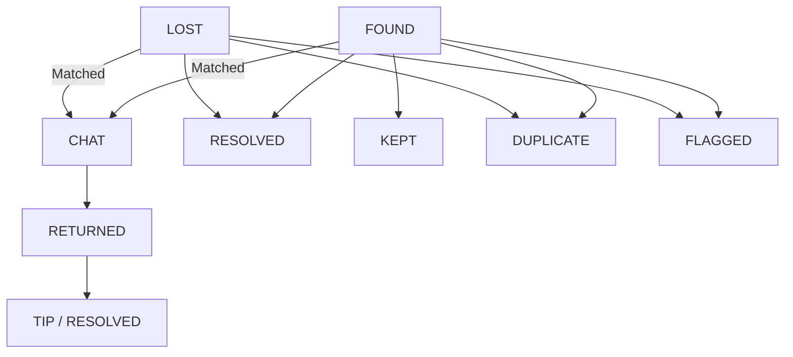

## 🧭 Overview of Key Screens & State-Driven Logic

| Screen               | Relevant Item States     | Who Sees It      |
| -------------------- | ------------------------ | ---------------- |
| Home / Feed          | All (not `flagged`)      | Everyone         |
| Post Item            | (creates `lost`/`found`) | Logged-in users  |
| Item Details         | Any item                 | Everyone         |
| Chat                 | `lost` ↔ `found`         | Poster & Finder  |
| Return Confirmation  | After chat               | Poster or Finder |
| Tip / Reward Screen  | `returned`, reward > 0   | Poster only      |
| Profile / My Items   | All own posts            | Logged-in users  |
| Admin Panel (future) | `flagged`, `duplicate`   | Admins           |

---

## 🔍 Detailed Screen Logic per Item Status

---

### 🏠 1. **Home / Feed Screen**

* Shows **all unresolved** items
* Filters: `lost`, `found`, category, location radius
* Status shown as:
  🟥 Lost — Red icon
  🟩 Found — Green icon
  ✅ Returned — Greyed
* Items with `resolved = true` are hidden unless "Archived" is toggled

---

### ➕ 2. **Post Item (Lost or Found)**

* Form fields: Title, Description, Category, Location, Image, Reward
* Saves item with:

  * `status = 'lost'` or `'found'`
  * `resolved = false`
* Uploads image to `item-images` bucket
* Geolocation saved to PostGIS field
* User redirected to Item Details screen

---

### 🔎 3. **Item Details**

* Displays:

  * Status badge (e.g. `LOST`, `FOUND`, `RETURNED`)
  * All item info
  * User profile (basic)
* Action buttons vary by status and user:

| Viewer        | Item Status        | Available Actions                 |
| ------------- | ------------------ | --------------------------------- |
| Poster        | `lost`/`found`     | Edit, Mark Resolved, Chat Replies |
| Other         | `lost`             | "I Found This" → Opens Chat       |
| Other         | `found`            | "I Lost This" → Opens Chat        |
| Poster/Finder | `returned`         | View Tip Button, Archive          |
| Everyone      | `kept`, `resolved` | Read-only mode                    |

* Show related matches (based on category, time, and distance)

---

### 💬 4. **Chat Screen**

* One-on-one chat between Finder and Poster
* Anchored to `item_id`
* Realtime messaging using Supabase
* After message is sent → “Mark As Returned” becomes visible to both

---

### ✅ 5. **Return Confirmation**

* Either party can initiate "Mark Item as Returned"
* Confirmation modal:
  "Have you physically received/given this item?"
* Upon confirm:

  * `item.status = 'returned'`
  * `item.resolved = true`
  * Karma events logged for both users
  * If reward was set → move to Tip screen

---

### 💰 6. **Tip / Reward Screen**

* Only visible if `reward_amount` > 0 and item is `returned`
* Uses Stripe Checkout or Connect
* Sender = Poster
  Receiver = Finder
* Tip recorded in `tips` table
* Status: `pending`, `succeeded`, `cancelled`

---

### 🧑 7. **Profile / My Items**

* User sees:

  * All their posts (lost, found, returned)
  * Karma score
  * Trusted returner badge (if applicable)
  * Option to edit profile pic (via `profile-pics` bucket)

---

### 🚩 8. **Admin / Moderator Panel (future)**

* Can view:

  * Flagged items
  * Marked duplicates
  * Abuse reports
* Can override status or ban users

---

## 🔄 State Transitions Summary

---

## 📘 Example Scenario Flow

1. Lisa posts **Lost Phone** (status: `lost`)
2. Tom posts **Found Phone** (status: `found`)
3. System suggests a match → Lisa and Tom chat
4. Tom gives it back to Lisa
5. Lisa clicks "Mark as Returned"
6. Lisa sees "Tip Finder \$15" screen → pays via Stripe
7. Both get karma → item marked `returned + resolved`

# COLOR SCHEME FOR APP
["#780000","#c1121f","#fdf0d5","#003049","#669bbc"]
---

## 🌈 Color Palette

| warning          | `#FFA930`    | Action accents, tags            |
| Success Green    | `#33C48D`    | Returned items, positive status |
| Error Red        | `#FF4C4C`    | Flags, errors                   |
> Colors are slightly soft with a modern web-safe tone — avoid over-saturation.
